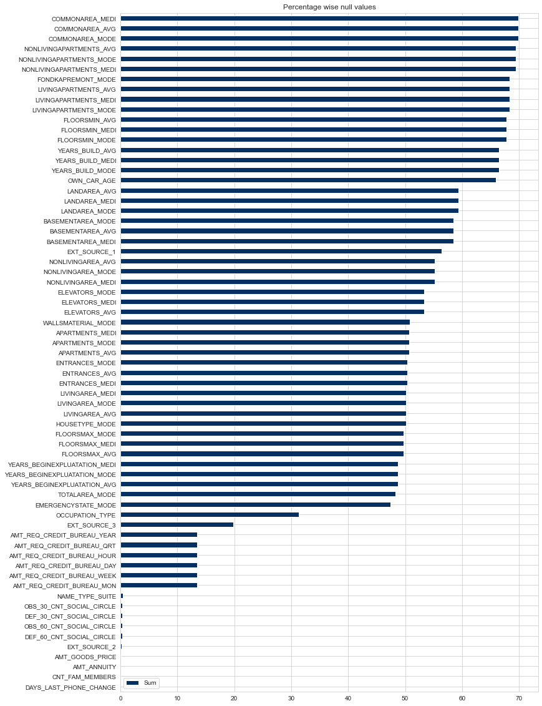
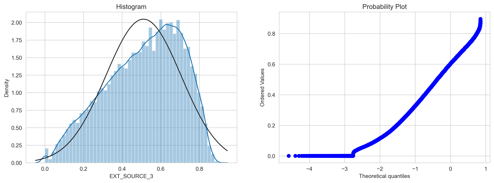
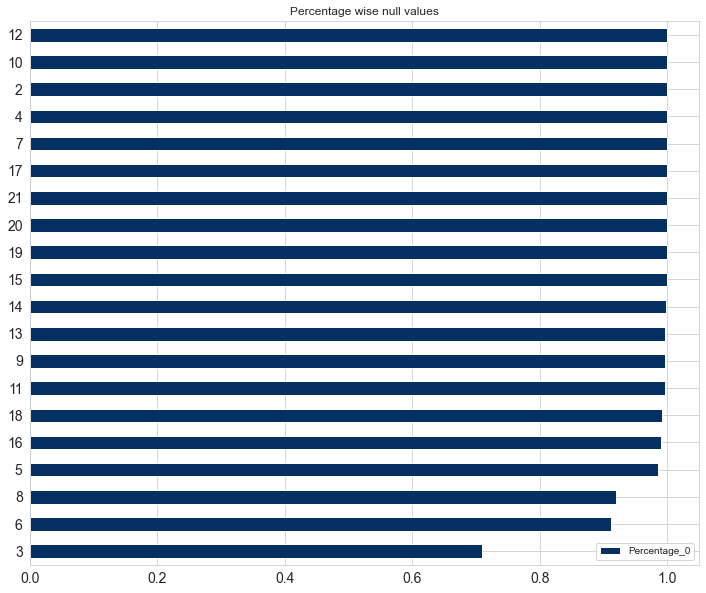

# Credit Card Fraud Detection
---

**Problem Statement**: Explore all possibilities while sanctioning a Loan to any customer.

# Data Description
---

The data for this problem statement can be found on Kaggle [at this link](https://www.kaggle.com/mishra5001/credit-card)


```python
import pandas as pd
import numpy as np
import matplotlib.pyplot as plt
import seaborn as sns
sns.set_style('whitegrid')
```


```python
data = pd.read_csv('application_data.csv')
data.head()
```

<div>

<table border="1" class="dataframe">
  <thead>
    <tr style="text-align: right;">
      <th></th>
      <th>SK_ID_CURR</th>
      <th>TARGET</th>
      <th>NAME_CONTRACT_TYPE</th>
      <th>CODE_GENDER</th>
      <th>FLAG_OWN_CAR</th>
      <th>FLAG_OWN_REALTY</th>
      <th>CNT_CHILDREN</th>
      <th>AMT_INCOME_TOTAL</th>
      <th>AMT_CREDIT</th>
      <th>AMT_ANNUITY</th>
      <th>...</th>
      <th>FLAG_DOCUMENT_18</th>
      <th>FLAG_DOCUMENT_19</th>
      <th>FLAG_DOCUMENT_20</th>
      <th>FLAG_DOCUMENT_21</th>
      <th>AMT_REQ_CREDIT_BUREAU_HOUR</th>
      <th>AMT_REQ_CREDIT_BUREAU_DAY</th>
      <th>AMT_REQ_CREDIT_BUREAU_WEEK</th>
      <th>AMT_REQ_CREDIT_BUREAU_MON</th>
      <th>AMT_REQ_CREDIT_BUREAU_QRT</th>
      <th>AMT_REQ_CREDIT_BUREAU_YEAR</th>
    </tr>
  </thead>
  <tbody>
    <tr>
      <th>0</th>
      <td>100002</td>
      <td>1</td>
      <td>Cash loans</td>
      <td>M</td>
      <td>N</td>
      <td>Y</td>
      <td>0</td>
      <td>202500.0</td>
      <td>406597.5</td>
      <td>24700.5</td>
      <td>...</td>
      <td>0</td>
      <td>0</td>
      <td>0</td>
      <td>0</td>
      <td>0.0</td>
      <td>0.0</td>
      <td>0.0</td>
      <td>0.0</td>
      <td>0.0</td>
      <td>1.0</td>
    </tr>
    <tr>
      <th>1</th>
      <td>100003</td>
      <td>0</td>
      <td>Cash loans</td>
      <td>F</td>
      <td>N</td>
      <td>N</td>
      <td>0</td>
      <td>270000.0</td>
      <td>1293502.5</td>
      <td>35698.5</td>
      <td>...</td>
      <td>0</td>
      <td>0</td>
      <td>0</td>
      <td>0</td>
      <td>0.0</td>
      <td>0.0</td>
      <td>0.0</td>
      <td>0.0</td>
      <td>0.0</td>
      <td>0.0</td>
    </tr>
    <tr>
      <th>2</th>
      <td>100004</td>
      <td>0</td>
      <td>Revolving loans</td>
      <td>M</td>
      <td>Y</td>
      <td>Y</td>
      <td>0</td>
      <td>67500.0</td>
      <td>135000.0</td>
      <td>6750.0</td>
      <td>...</td>
      <td>0</td>
      <td>0</td>
      <td>0</td>
      <td>0</td>
      <td>0.0</td>
      <td>0.0</td>
      <td>0.0</td>
      <td>0.0</td>
      <td>0.0</td>
      <td>0.0</td>
    </tr>
    <tr>
      <th>3</th>
      <td>100006</td>
      <td>0</td>
      <td>Cash loans</td>
      <td>F</td>
      <td>N</td>
      <td>Y</td>
      <td>0</td>
      <td>135000.0</td>
      <td>312682.5</td>
      <td>29686.5</td>
      <td>...</td>
      <td>0</td>
      <td>0</td>
      <td>0</td>
      <td>0</td>
      <td>NaN</td>
      <td>NaN</td>
      <td>NaN</td>
      <td>NaN</td>
      <td>NaN</td>
      <td>NaN</td>
    </tr>
    <tr>
      <th>4</th>
      <td>100007</td>
      <td>0</td>
      <td>Cash loans</td>
      <td>M</td>
      <td>N</td>
      <td>Y</td>
      <td>0</td>
      <td>121500.0</td>
      <td>513000.0</td>
      <td>21865.5</td>
      <td>...</td>
      <td>0</td>
      <td>0</td>
      <td>0</td>
      <td>0</td>
      <td>0.0</td>
      <td>0.0</td>
      <td>0.0</td>
      <td>0.0</td>
      <td>0.0</td>
      <td>0.0</td>
    </tr>
  </tbody>
</table>
<p>5 rows × 122 columns</p>
</div>


```python
data.shape
```


    (307511, 122)


```python
data.describe().T
```


<div>

<table border="1" class="dataframe">
  <thead>
    <tr style="text-align: right;">
      <th></th>
      <th>count</th>
      <th>mean</th>
      <th>std</th>
      <th>min</th>
      <th>25%</th>
      <th>50%</th>
      <th>75%</th>
      <th>max</th>
    </tr>
  </thead>
  <tbody>
    <tr>
      <th>TARGET</th>
      <td>307511.0</td>
      <td>0.080729</td>
      <td>0.272419</td>
      <td>0.000000e+00</td>
      <td>0.000000</td>
      <td>0.000000</td>
      <td>0.000000</td>
      <td>1.000000e+00</td>
    </tr>
    <tr>
      <th>MALE</th>
      <td>307511.0</td>
      <td>0.341656</td>
      <td>0.474266</td>
      <td>0.000000e+00</td>
      <td>0.000000</td>
      <td>0.000000</td>
      <td>1.000000</td>
      <td>1.000000e+00</td>
    </tr>
    <tr>
      <th>FLAG_OWN_CAR</th>
      <td>307511.0</td>
      <td>0.340108</td>
      <td>0.473746</td>
      <td>0.000000e+00</td>
      <td>0.000000</td>
      <td>0.000000</td>
      <td>1.000000</td>
      <td>1.000000e+00</td>
    </tr>
    <tr>
      <th>FLAG_OWN_REALTY</th>
      <td>307511.0</td>
      <td>0.693673</td>
      <td>0.460968</td>
      <td>0.000000e+00</td>
      <td>0.000000</td>
      <td>1.000000</td>
      <td>1.000000</td>
      <td>1.000000e+00</td>
    </tr>
    <tr>
      <th>CNT_CHILDREN</th>
      <td>307511.0</td>
      <td>0.417052</td>
      <td>0.722121</td>
      <td>0.000000e+00</td>
      <td>0.000000</td>
      <td>0.000000</td>
      <td>1.000000</td>
      <td>1.900000e+01</td>
    </tr>
    <tr>
      <th>AMT_INCOME_TOTAL</th>
      <td>307511.0</td>
      <td>168797.919297</td>
      <td>237123.146279</td>
      <td>2.565000e+04</td>
      <td>112500.000000</td>
      <td>147150.000000</td>
      <td>202500.000000</td>
      <td>1.170000e+08</td>
    </tr>
    <tr>
      <th>AMT_CREDIT</th>
      <td>307511.0</td>
      <td>599025.999706</td>
      <td>402490.776996</td>
      <td>4.500000e+04</td>
      <td>270000.000000</td>
      <td>513531.000000</td>
      <td>808650.000000</td>
      <td>4.050000e+06</td>
    </tr>
    <tr>
      <th>AMT_ANNUITY</th>
      <td>307499.0</td>
      <td>27108.573909</td>
      <td>14493.737315</td>
      <td>1.615500e+03</td>
      <td>16524.000000</td>
      <td>24903.000000</td>
      <td>34596.000000</td>
      <td>2.580255e+05</td>
    </tr>
    <tr>
      <th>AMT_GOODS_PRICE</th>
      <td>307233.0</td>
      <td>538396.207429</td>
      <td>369446.460540</td>
      <td>4.050000e+04</td>
      <td>238500.000000</td>
      <td>450000.000000</td>
      <td>679500.000000</td>
      <td>4.050000e+06</td>
    </tr>
    <tr>
      <th>REGION_POPULATION_RELATIVE</th>
      <td>307511.0</td>
      <td>0.020868</td>
      <td>0.013831</td>
      <td>2.900000e-04</td>
      <td>0.010006</td>
      <td>0.018850</td>
      <td>0.028663</td>
      <td>7.250800e-02</td>
    </tr>
    <tr>
      <th>AGE</th>
      <td>307511.0</td>
      <td>43.435968</td>
      <td>11.954593</td>
      <td>2.000000e+01</td>
      <td>34.000000</td>
      <td>43.000000</td>
      <td>53.000000</td>
      <td>6.900000e+01</td>
    </tr>
    <tr>
      <th>EXP_YEARS</th>
      <td>307511.0</td>
      <td>-175.121693</td>
      <td>386.611073</td>
      <td>-1.000000e+03</td>
      <td>0.000000</td>
      <td>3.000000</td>
      <td>7.000000</td>
      <td>4.900000e+01</td>
    </tr>
    <tr>
      <th>DAYS_REGISTRATION</th>
      <td>307511.0</td>
      <td>-4986.120328</td>
      <td>3522.886321</td>
      <td>-2.467200e+04</td>
      <td>-7479.500000</td>
      <td>-4504.000000</td>
      <td>-2010.000000</td>
      <td>0.000000e+00</td>
    </tr>
    <tr>
      <th>DAYS_ID_PUBLISH</th>
      <td>307511.0</td>
      <td>-2994.202373</td>
      <td>1509.450419</td>
      <td>-7.197000e+03</td>
      <td>-4299.000000</td>
      <td>-3254.000000</td>
      <td>-1720.000000</td>
      <td>0.000000e+00</td>
    </tr>
    <tr>
      <th>CNT_FAM_MEMBERS</th>
      <td>307509.0</td>
      <td>2.152665</td>
      <td>0.910682</td>
      <td>1.000000e+00</td>
      <td>2.000000</td>
      <td>2.000000</td>
      <td>3.000000</td>
      <td>2.000000e+01</td>
    </tr>
    <tr>
      <th>REGION_RATING_CLIENT</th>
      <td>307511.0</td>
      <td>2.052463</td>
      <td>0.509034</td>
      <td>1.000000e+00</td>
      <td>2.000000</td>
      <td>2.000000</td>
      <td>2.000000</td>
      <td>3.000000e+00</td>
    </tr>
    <tr>
      <th>REGION_RATING_CLIENT_W_CITY</th>
      <td>307511.0</td>
      <td>2.031521</td>
      <td>0.502737</td>
      <td>1.000000e+00</td>
      <td>2.000000</td>
      <td>2.000000</td>
      <td>2.000000</td>
      <td>3.000000e+00</td>
    </tr>
    <tr>
      <th>REG_REGION_NOT_LIVE_REGION</th>
      <td>307511.0</td>
      <td>0.015144</td>
      <td>0.122126</td>
      <td>0.000000e+00</td>
      <td>0.000000</td>
      <td>0.000000</td>
      <td>0.000000</td>
      <td>1.000000e+00</td>
    </tr>
    <tr>
      <th>REG_REGION_NOT_WORK_REGION</th>
      <td>307511.0</td>
      <td>0.050769</td>
      <td>0.219526</td>
      <td>0.000000e+00</td>
      <td>0.000000</td>
      <td>0.000000</td>
      <td>0.000000</td>
      <td>1.000000e+00</td>
    </tr>
    <tr>
      <th>LIVE_REGION_NOT_WORK_REGION</th>
      <td>307511.0</td>
      <td>0.040659</td>
      <td>0.197499</td>
      <td>0.000000e+00</td>
      <td>0.000000</td>
      <td>0.000000</td>
      <td>0.000000</td>
      <td>1.000000e+00</td>
    </tr>
    <tr>
      <th>REG_CITY_NOT_LIVE_CITY</th>
      <td>307511.0</td>
      <td>0.078173</td>
      <td>0.268444</td>
      <td>0.000000e+00</td>
      <td>0.000000</td>
      <td>0.000000</td>
      <td>0.000000</td>
      <td>1.000000e+00</td>
    </tr>
    <tr>
      <th>REG_CITY_NOT_WORK_CITY</th>
      <td>307511.0</td>
      <td>0.230454</td>
      <td>0.421124</td>
      <td>0.000000e+00</td>
      <td>0.000000</td>
      <td>0.000000</td>
      <td>0.000000</td>
      <td>1.000000e+00</td>
    </tr>
    <tr>
      <th>LIVE_CITY_NOT_WORK_CITY</th>
      <td>307511.0</td>
      <td>0.179555</td>
      <td>0.383817</td>
      <td>0.000000e+00</td>
      <td>0.000000</td>
      <td>0.000000</td>
      <td>0.000000</td>
      <td>1.000000e+00</td>
    </tr>
    <tr>
      <th>EXT_SOURCE_2</th>
      <td>306851.0</td>
      <td>0.514393</td>
      <td>0.191060</td>
      <td>8.170000e-08</td>
      <td>0.392457</td>
      <td>0.565961</td>
      <td>0.663617</td>
      <td>8.549997e-01</td>
    </tr>
    <tr>
      <th>EXT_SOURCE_3</th>
      <td>307511.0</td>
      <td>0.515695</td>
      <td>0.174736</td>
      <td>5.272650e-04</td>
      <td>0.417100</td>
      <td>0.535276</td>
      <td>0.636376</td>
      <td>8.960095e-01</td>
    </tr>
    <tr>
      <th>OBS_30_CNT_SOCIAL_CIRCLE</th>
      <td>306490.0</td>
      <td>1.422245</td>
      <td>2.400989</td>
      <td>0.000000e+00</td>
      <td>0.000000</td>
      <td>0.000000</td>
      <td>2.000000</td>
      <td>3.480000e+02</td>
    </tr>
    <tr>
      <th>DEF_30_CNT_SOCIAL_CIRCLE</th>
      <td>306490.0</td>
      <td>0.143421</td>
      <td>0.446698</td>
      <td>0.000000e+00</td>
      <td>0.000000</td>
      <td>0.000000</td>
      <td>0.000000</td>
      <td>3.400000e+01</td>
    </tr>
    <tr>
      <th>OBS_60_CNT_SOCIAL_CIRCLE</th>
      <td>306490.0</td>
      <td>1.405292</td>
      <td>2.379803</td>
      <td>0.000000e+00</td>
      <td>0.000000</td>
      <td>0.000000</td>
      <td>2.000000</td>
      <td>3.440000e+02</td>
    </tr>
    <tr>
      <th>DEF_60_CNT_SOCIAL_CIRCLE</th>
      <td>306490.0</td>
      <td>0.100049</td>
      <td>0.362291</td>
      <td>0.000000e+00</td>
      <td>0.000000</td>
      <td>0.000000</td>
      <td>0.000000</td>
      <td>2.400000e+01</td>
    </tr>
    <tr>
      <th>AMT_REQ_CREDIT_BUREAU_HOUR</th>
      <td>307511.0</td>
      <td>0.005538</td>
      <td>0.078014</td>
      <td>0.000000e+00</td>
      <td>0.000000</td>
      <td>0.000000</td>
      <td>0.000000</td>
      <td>4.000000e+00</td>
    </tr>
    <tr>
      <th>AMT_REQ_CREDIT_BUREAU_DAY</th>
      <td>307511.0</td>
      <td>0.006055</td>
      <td>0.103037</td>
      <td>0.000000e+00</td>
      <td>0.000000</td>
      <td>0.000000</td>
      <td>0.000000</td>
      <td>9.000000e+00</td>
    </tr>
    <tr>
      <th>AMT_REQ_CREDIT_BUREAU_WEEK</th>
      <td>307511.0</td>
      <td>0.029723</td>
      <td>0.190728</td>
      <td>0.000000e+00</td>
      <td>0.000000</td>
      <td>0.000000</td>
      <td>0.000000</td>
      <td>8.000000e+00</td>
    </tr>
    <tr>
      <th>AMT_REQ_CREDIT_BUREAU_MON</th>
      <td>307511.0</td>
      <td>0.231293</td>
      <td>0.856810</td>
      <td>0.000000e+00</td>
      <td>0.000000</td>
      <td>0.000000</td>
      <td>0.000000</td>
      <td>2.700000e+01</td>
    </tr>
    <tr>
      <th>AMT_REQ_CREDIT_BUREAU_QRT</th>
      <td>307511.0</td>
      <td>0.229631</td>
      <td>0.744059</td>
      <td>0.000000e+00</td>
      <td>0.000000</td>
      <td>0.000000</td>
      <td>0.000000</td>
      <td>2.610000e+02</td>
    </tr>
    <tr>
      <th>CNT_DOCUMENT</th>
      <td>307511.0</td>
      <td>0.930155</td>
      <td>0.344295</td>
      <td>0.000000e+00</td>
      <td>1.000000</td>
      <td>1.000000</td>
      <td>1.000000</td>
      <td>4.000000e+00</td>
    </tr>
  </tbody>
</table>
</div>


```python
drop_columns = list()
```

# Replacing Values

---

#### NAME_TYPE_SUITE

```code
Unaccompanied      248526
Family              40149
Spouse, partner     11370
Children             3267
Other_B              1770
Other_A               866
Group of people       271
```
Note -
1. We will drop this variable since it does not provide any relevant information

---

#### NAME_INCOME_TYPE 

```code
Working                 158774
Commercial associate     71617
Pensioner                55362
State servant            21703
Unemployed                  22
Student                     18
Businessman                 10
Maternity leave              5
```
Note -
1. Considering `Commercial associate`, `State servant`, `Maternity leave` as `Working` type.
2. Rename `Pensioner` as `Retired`.

**Final Categories: [Student, Unemployed, Working, Businessman, Retired]**

---

#### NAME_EDUCATION_TYPE 

```code
Secondary / secondary special    218391
Higher education                  74863
Incomplete higher                 10277
Lower secondary                    3816
Academic degree                     164
```
Note -
1. `Academic degree` is equivalent to `Higher Education`.
2. Considering `Incomplete higher` as `Secondary_Education`.

**Final Categories: [Lower_Secondary, Secondary_Education, Higher_Education]**

---

#### NAME_FAMILY_STATUS

```code
Married                 196432
Single / not married     45444
Civil marriage           29775
Separated                19770
Widow                    16088
Unknown                      2
```
Note -
1. Considering `Civil marriage`, `Separated`, `Widow`, `Unknown` as `Married`.

**Final Categories: [Married, Single]**

---

#### NAME_HOUSING_TYPE

```code
House / apartment      272868
With parents            14840
Municipal apartment     11183
Rented apartment         4881
Office apartment         2617
Co-op apartment          1122
```
Note -
1. Considering `House / apartment`, `With parents` as `Owned` type.
2. Considering `Municipal apartment`, `Office apartment` as `Freehold` type.
3. Considering `Rented apartment`, `Co-op` apartment as `Rented` type.

**Final Categories: [Owned, Freehold, Rented]**

---

#### OCCUPATION_TYPE

```code
Laborers                 55186
Sales staff              32102
Core staff               27570
Managers                 21371
Drivers                  18603
High skill tech staff    11380
Accountants               9813
Medicine staff            8537
Security staff            6721
Cooking staff             5946
Cleaning staff            4653
Private service staff     2652
Low-skill Laborers        2093
Waiters/barmen staff      1348
Secretaries               1305
Realty agents              751
HR staff                   563
IT staff                   526
```
Note -
1. We will drop this feature since it can provide bias information. We already have `Income Amount` and `Organization Type` which can provide a better insight.


```python
replace_dict = {
    "Commercial associate" : "Working", 
    "State servant"        : "Working", 
    "Maternity leave"      : "Working", 
    "Pensioner"            : "Retired"
}
data['NAME_INCOME_TYPE'].replace(replace_dict, inplace=True)


replace_dict = {
    "Secondary / secondary special" : "Secondary_Education",
    "Higher education"              : "Higher_Education",
    "Incomplete higher"             : "Secondary_Education",
    "Lower secondary"               : "Lower_Secondary",
    "Academic degree"               : "Higher Education"
}
data['NAME_EDUCATION_TYPE'].replace(replace_dict, inplace=True)


replace_dict = {
    "Single / not married" : "Single",
    "Civil marriage"       : "Married",
    "Separated"            : "Married",
    "Widow"                : "Married",
    "Unknown"              : "Married"
}
data['NAME_FAMILY_STATUS'].replace(replace_dict, inplace=True)


replace_dict = {
    "House / apartment"   : "Owned",
    "With parents"        : "Owned",
    "Municipal apartment" : "Freehold",
    "Office apartment"    : "Freehold",
    "Rented apartment"    : "Rented",
    "Co-op"               : "Rented"
}
data['NAME_HOUSING_TYPE'].replace(replace_dict, inplace=True)


drop_columns.extend(['NAME_TYPE_SUITE', 'OCCUPATION_TYPE'])
```

# Missing Value Treatment


```python
## Get the dataframe with all the features and SUM of the NaN values present
df_null_count = data.isnull().sum().to_frame().rename({0:"Sum"}, axis=1)

## Select only those features who have atleast 1 NaN value
df_null_count = df_null_count[df_null_count['Sum'] > 0]

## Change the SUM to PERCENTAGE 
df_null_count['Sum'] = df_null_count['Sum']*(100/n_samples)

## Plot a Horizontal Bar Graph
df_null_count.sort_values(by="Sum", ascending=True).plot(
    kind='barh', figsize=(12, 20), colormap="RdBu_r", title="Percentage wise null values"
)
plt.show()
```


    

    


```python
drop_columns.extend(df_null_count[df_null_count['Sum'] > 35].index)
```


```python
def plot_distribution(series_):
    
    ## GET SKEWNESS 
    print(f"Skewness Co-efficient: {round(series_.skew(), 3)}")

    fig, (ax1, ax2) = plt.subplots(1, 2, figsize=(15, 5), dpi=300)

    ## HISTOGRAM 
    from scipy import stats
    sns.distplot(series_ , fit=stats.norm, ax=ax1)
    ax1.set_title('Histogram')

    ## PROBABILITY / QQ PLOT 
    stats.probplot(series_, plot=ax2)

    plt.show()
```


```python
plot_distribution(data['EXT_SOURCE_3'])
```

    Skewness Co-efficient: -0.409
    

    C:\ProgramData\Anaconda3\lib\site-packages\seaborn\distributions.py:2551: FutureWarning: `distplot` is a deprecated function and will be removed in a future version. Please adapt your code to use either `displot` (a figure-level function with similar flexibility) or `histplot` (an axes-level function for histograms).
      warnings.warn(msg, FutureWarning)
    


    

    


```python
data['EXT_SOURCE_3'].fillna(data['EXT_SOURCE_3'].median(), inplace=True)
```


```python
cred_bureau_cols = [col for col in data.columns if col.startswith("AMT_REQ_CREDIT_BUREAU_")]

data[cred_bureau_cols][data['AMT_REQ_CREDIT_BUREAU_WEEK'].isnull()]
```


<div>

<table border="1" class="dataframe">
  <thead>
    <tr style="text-align: right;">
      <th></th>
      <th>AMT_REQ_CREDIT_BUREAU_HOUR</th>
      <th>AMT_REQ_CREDIT_BUREAU_DAY</th>
      <th>AMT_REQ_CREDIT_BUREAU_WEEK</th>
      <th>AMT_REQ_CREDIT_BUREAU_MON</th>
      <th>AMT_REQ_CREDIT_BUREAU_QRT</th>
      <th>AMT_REQ_CREDIT_BUREAU_YEAR</th>
    </tr>
  </thead>
  <tbody>
    <tr>
      <th>3</th>
      <td>NaN</td>
      <td>NaN</td>
      <td>NaN</td>
      <td>NaN</td>
      <td>NaN</td>
      <td>NaN</td>
    </tr>
    <tr>
      <th>9</th>
      <td>NaN</td>
      <td>NaN</td>
      <td>NaN</td>
      <td>NaN</td>
      <td>NaN</td>
      <td>NaN</td>
    </tr>
    <tr>
      <th>14</th>
      <td>NaN</td>
      <td>NaN</td>
      <td>NaN</td>
      <td>NaN</td>
      <td>NaN</td>
      <td>NaN</td>
    </tr>
    <tr>
      <th>17</th>
      <td>NaN</td>
      <td>NaN</td>
      <td>NaN</td>
      <td>NaN</td>
      <td>NaN</td>
      <td>NaN</td>
    </tr>
    <tr>
      <th>20</th>
      <td>NaN</td>
      <td>NaN</td>
      <td>NaN</td>
      <td>NaN</td>
      <td>NaN</td>
      <td>NaN</td>
    </tr>
    <tr>
      <th>...</th>
      <td>...</td>
      <td>...</td>
      <td>...</td>
      <td>...</td>
      <td>...</td>
      <td>...</td>
    </tr>
    <tr>
      <th>307484</th>
      <td>NaN</td>
      <td>NaN</td>
      <td>NaN</td>
      <td>NaN</td>
      <td>NaN</td>
      <td>NaN</td>
    </tr>
    <tr>
      <th>307501</th>
      <td>NaN</td>
      <td>NaN</td>
      <td>NaN</td>
      <td>NaN</td>
      <td>NaN</td>
      <td>NaN</td>
    </tr>
    <tr>
      <th>307504</th>
      <td>NaN</td>
      <td>NaN</td>
      <td>NaN</td>
      <td>NaN</td>
      <td>NaN</td>
      <td>NaN</td>
    </tr>
    <tr>
      <th>307506</th>
      <td>NaN</td>
      <td>NaN</td>
      <td>NaN</td>
      <td>NaN</td>
      <td>NaN</td>
      <td>NaN</td>
    </tr>
    <tr>
      <th>307507</th>
      <td>NaN</td>
      <td>NaN</td>
      <td>NaN</td>
      <td>NaN</td>
      <td>NaN</td>
      <td>NaN</td>
    </tr>
  </tbody>
</table>
<p>41519 rows × 6 columns</p>
</div>


```python
data['AMT_REQ_CREDIT_BUREAU_MON'].fillna(0.0, inplace=True)
```


```python
'''
Equal to 0 is 2.5l+ for day and week, 2.0l+ for qtr, 71k for year
'''
drop_columns.extend(['AMT_REQ_CREDIT_BUREAU_YEAR', 'DAYS_LAST_PHONE_CHANGE'])

for col in cred_bureau_cols:
    data[col].fillna(0.0, inplace=True)
#data[data['AMT_REQ_CREDIT_BUREAU_YEAR'] == 0.0]
```


```python
data.drop(columns=drop_columns, inplace=True)
data.dropna()
```


<div>

<table border="1" class="dataframe">
  <thead>
    <tr style="text-align: right;">
      <th></th>
      <th>SK_ID_CURR</th>
      <th>TARGET</th>
      <th>NAME_CONTRACT_TYPE</th>
      <th>CODE_GENDER</th>
      <th>FLAG_OWN_CAR</th>
      <th>FLAG_OWN_REALTY</th>
      <th>CNT_CHILDREN</th>
      <th>AMT_INCOME_TOTAL</th>
      <th>AMT_CREDIT</th>
      <th>AMT_ANNUITY</th>
      <th>...</th>
      <th>FLAG_DOCUMENT_17</th>
      <th>FLAG_DOCUMENT_18</th>
      <th>FLAG_DOCUMENT_19</th>
      <th>FLAG_DOCUMENT_20</th>
      <th>FLAG_DOCUMENT_21</th>
      <th>AMT_REQ_CREDIT_BUREAU_HOUR</th>
      <th>AMT_REQ_CREDIT_BUREAU_DAY</th>
      <th>AMT_REQ_CREDIT_BUREAU_WEEK</th>
      <th>AMT_REQ_CREDIT_BUREAU_MON</th>
      <th>AMT_REQ_CREDIT_BUREAU_QRT</th>
    </tr>
  </thead>
  <tbody>
    <tr>
      <th>0</th>
      <td>100002</td>
      <td>1</td>
      <td>Cash loans</td>
      <td>M</td>
      <td>N</td>
      <td>Y</td>
      <td>0</td>
      <td>202500.0</td>
      <td>406597.5</td>
      <td>24700.5</td>
      <td>...</td>
      <td>0</td>
      <td>0</td>
      <td>0</td>
      <td>0</td>
      <td>0</td>
      <td>0.0</td>
      <td>0.0</td>
      <td>0.0</td>
      <td>0.0</td>
      <td>0.0</td>
    </tr>
    <tr>
      <th>1</th>
      <td>100003</td>
      <td>0</td>
      <td>Cash loans</td>
      <td>F</td>
      <td>N</td>
      <td>N</td>
      <td>0</td>
      <td>270000.0</td>
      <td>1293502.5</td>
      <td>35698.5</td>
      <td>...</td>
      <td>0</td>
      <td>0</td>
      <td>0</td>
      <td>0</td>
      <td>0</td>
      <td>0.0</td>
      <td>0.0</td>
      <td>0.0</td>
      <td>0.0</td>
      <td>0.0</td>
    </tr>
    <tr>
      <th>2</th>
      <td>100004</td>
      <td>0</td>
      <td>Revolving loans</td>
      <td>M</td>
      <td>Y</td>
      <td>Y</td>
      <td>0</td>
      <td>67500.0</td>
      <td>135000.0</td>
      <td>6750.0</td>
      <td>...</td>
      <td>0</td>
      <td>0</td>
      <td>0</td>
      <td>0</td>
      <td>0</td>
      <td>0.0</td>
      <td>0.0</td>
      <td>0.0</td>
      <td>0.0</td>
      <td>0.0</td>
    </tr>
    <tr>
      <th>3</th>
      <td>100006</td>
      <td>0</td>
      <td>Cash loans</td>
      <td>F</td>
      <td>N</td>
      <td>Y</td>
      <td>0</td>
      <td>135000.0</td>
      <td>312682.5</td>
      <td>29686.5</td>
      <td>...</td>
      <td>0</td>
      <td>0</td>
      <td>0</td>
      <td>0</td>
      <td>0</td>
      <td>0.0</td>
      <td>0.0</td>
      <td>0.0</td>
      <td>0.0</td>
      <td>0.0</td>
    </tr>
    <tr>
      <th>4</th>
      <td>100007</td>
      <td>0</td>
      <td>Cash loans</td>
      <td>M</td>
      <td>N</td>
      <td>Y</td>
      <td>0</td>
      <td>121500.0</td>
      <td>513000.0</td>
      <td>21865.5</td>
      <td>...</td>
      <td>0</td>
      <td>0</td>
      <td>0</td>
      <td>0</td>
      <td>0</td>
      <td>0.0</td>
      <td>0.0</td>
      <td>0.0</td>
      <td>0.0</td>
      <td>0.0</td>
    </tr>
    <tr>
      <th>...</th>
      <td>...</td>
      <td>...</td>
      <td>...</td>
      <td>...</td>
      <td>...</td>
      <td>...</td>
      <td>...</td>
      <td>...</td>
      <td>...</td>
      <td>...</td>
      <td>...</td>
      <td>...</td>
      <td>...</td>
      <td>...</td>
      <td>...</td>
      <td>...</td>
      <td>...</td>
      <td>...</td>
      <td>...</td>
      <td>...</td>
      <td>...</td>
    </tr>
    <tr>
      <th>307506</th>
      <td>456251</td>
      <td>0</td>
      <td>Cash loans</td>
      <td>M</td>
      <td>N</td>
      <td>N</td>
      <td>0</td>
      <td>157500.0</td>
      <td>254700.0</td>
      <td>27558.0</td>
      <td>...</td>
      <td>0</td>
      <td>0</td>
      <td>0</td>
      <td>0</td>
      <td>0</td>
      <td>0.0</td>
      <td>0.0</td>
      <td>0.0</td>
      <td>0.0</td>
      <td>0.0</td>
    </tr>
    <tr>
      <th>307507</th>
      <td>456252</td>
      <td>0</td>
      <td>Cash loans</td>
      <td>F</td>
      <td>N</td>
      <td>Y</td>
      <td>0</td>
      <td>72000.0</td>
      <td>269550.0</td>
      <td>12001.5</td>
      <td>...</td>
      <td>0</td>
      <td>0</td>
      <td>0</td>
      <td>0</td>
      <td>0</td>
      <td>0.0</td>
      <td>0.0</td>
      <td>0.0</td>
      <td>0.0</td>
      <td>0.0</td>
    </tr>
    <tr>
      <th>307508</th>
      <td>456253</td>
      <td>0</td>
      <td>Cash loans</td>
      <td>F</td>
      <td>N</td>
      <td>Y</td>
      <td>0</td>
      <td>153000.0</td>
      <td>677664.0</td>
      <td>29979.0</td>
      <td>...</td>
      <td>0</td>
      <td>0</td>
      <td>0</td>
      <td>0</td>
      <td>0</td>
      <td>1.0</td>
      <td>0.0</td>
      <td>0.0</td>
      <td>1.0</td>
      <td>0.0</td>
    </tr>
    <tr>
      <th>307509</th>
      <td>456254</td>
      <td>1</td>
      <td>Cash loans</td>
      <td>F</td>
      <td>N</td>
      <td>Y</td>
      <td>0</td>
      <td>171000.0</td>
      <td>370107.0</td>
      <td>20205.0</td>
      <td>...</td>
      <td>0</td>
      <td>0</td>
      <td>0</td>
      <td>0</td>
      <td>0</td>
      <td>0.0</td>
      <td>0.0</td>
      <td>0.0</td>
      <td>0.0</td>
      <td>0.0</td>
    </tr>
    <tr>
      <th>307510</th>
      <td>456255</td>
      <td>0</td>
      <td>Cash loans</td>
      <td>F</td>
      <td>N</td>
      <td>N</td>
      <td>0</td>
      <td>157500.0</td>
      <td>675000.0</td>
      <td>49117.5</td>
      <td>...</td>
      <td>0</td>
      <td>0</td>
      <td>0</td>
      <td>0</td>
      <td>0</td>
      <td>0.0</td>
      <td>0.0</td>
      <td>0.0</td>
      <td>2.0</td>
      <td>0.0</td>
    </tr>
  </tbody>
</table>
<p>305545 rows × 69 columns</p>
</div>


# Feature Engineering


```python
flag_doc_cols = [f"FLAG_DOCUMENT_{i}" for i in range(2, 22)]

other_flags = list(set([col for col in data.columns if col.startswith("FLAG")]).difference(set(flag_doc_cols)))
```


```python
data[flag_doc_cols].head()
```


<div>

<table border="1" class="dataframe">
  <thead>
    <tr style="text-align: right;">
      <th></th>
      <th>FLAG_DOCUMENT_2</th>
      <th>FLAG_DOCUMENT_3</th>
      <th>FLAG_DOCUMENT_4</th>
      <th>FLAG_DOCUMENT_5</th>
      <th>FLAG_DOCUMENT_6</th>
      <th>FLAG_DOCUMENT_7</th>
      <th>FLAG_DOCUMENT_8</th>
      <th>FLAG_DOCUMENT_9</th>
      <th>FLAG_DOCUMENT_10</th>
      <th>FLAG_DOCUMENT_11</th>
      <th>FLAG_DOCUMENT_12</th>
      <th>FLAG_DOCUMENT_13</th>
      <th>FLAG_DOCUMENT_14</th>
      <th>FLAG_DOCUMENT_15</th>
      <th>FLAG_DOCUMENT_16</th>
      <th>FLAG_DOCUMENT_17</th>
      <th>FLAG_DOCUMENT_18</th>
      <th>FLAG_DOCUMENT_19</th>
      <th>FLAG_DOCUMENT_20</th>
      <th>FLAG_DOCUMENT_21</th>
    </tr>
  </thead>
  <tbody>
    <tr>
      <th>0</th>
      <td>0</td>
      <td>1</td>
      <td>0</td>
      <td>0</td>
      <td>0</td>
      <td>0</td>
      <td>0</td>
      <td>0</td>
      <td>0</td>
      <td>0</td>
      <td>0</td>
      <td>0</td>
      <td>0</td>
      <td>0</td>
      <td>0</td>
      <td>0</td>
      <td>0</td>
      <td>0</td>
      <td>0</td>
      <td>0</td>
    </tr>
    <tr>
      <th>1</th>
      <td>0</td>
      <td>1</td>
      <td>0</td>
      <td>0</td>
      <td>0</td>
      <td>0</td>
      <td>0</td>
      <td>0</td>
      <td>0</td>
      <td>0</td>
      <td>0</td>
      <td>0</td>
      <td>0</td>
      <td>0</td>
      <td>0</td>
      <td>0</td>
      <td>0</td>
      <td>0</td>
      <td>0</td>
      <td>0</td>
    </tr>
    <tr>
      <th>2</th>
      <td>0</td>
      <td>0</td>
      <td>0</td>
      <td>0</td>
      <td>0</td>
      <td>0</td>
      <td>0</td>
      <td>0</td>
      <td>0</td>
      <td>0</td>
      <td>0</td>
      <td>0</td>
      <td>0</td>
      <td>0</td>
      <td>0</td>
      <td>0</td>
      <td>0</td>
      <td>0</td>
      <td>0</td>
      <td>0</td>
    </tr>
    <tr>
      <th>3</th>
      <td>0</td>
      <td>1</td>
      <td>0</td>
      <td>0</td>
      <td>0</td>
      <td>0</td>
      <td>0</td>
      <td>0</td>
      <td>0</td>
      <td>0</td>
      <td>0</td>
      <td>0</td>
      <td>0</td>
      <td>0</td>
      <td>0</td>
      <td>0</td>
      <td>0</td>
      <td>0</td>
      <td>0</td>
      <td>0</td>
    </tr>
    <tr>
      <th>4</th>
      <td>0</td>
      <td>0</td>
      <td>0</td>
      <td>0</td>
      <td>0</td>
      <td>0</td>
      <td>1</td>
      <td>0</td>
      <td>0</td>
      <td>0</td>
      <td>0</td>
      <td>0</td>
      <td>0</td>
      <td>0</td>
      <td>0</td>
      <td>0</td>
      <td>0</td>
      <td>0</td>
      <td>0</td>
      <td>0</td>
    </tr>
  </tbody>
</table>
</div>


```python
data[other_flags].head()
```


<div>

<table border="1" class="dataframe">
  <thead>
    <tr style="text-align: right;">
      <th></th>
      <th>FLAG_WORK_PHONE</th>
      <th>FLAG_MOBIL</th>
      <th>FLAG_PHONE</th>
      <th>FLAG_OWN_CAR</th>
      <th>FLAG_EMP_PHONE</th>
      <th>FLAG_CONT_MOBILE</th>
      <th>FLAG_EMAIL</th>
      <th>FLAG_OWN_REALTY</th>
    </tr>
  </thead>
  <tbody>
    <tr>
      <th>0</th>
      <td>0</td>
      <td>1</td>
      <td>1</td>
      <td>N</td>
      <td>1</td>
      <td>1</td>
      <td>0</td>
      <td>Y</td>
    </tr>
    <tr>
      <th>1</th>
      <td>0</td>
      <td>1</td>
      <td>1</td>
      <td>N</td>
      <td>1</td>
      <td>1</td>
      <td>0</td>
      <td>N</td>
    </tr>
    <tr>
      <th>2</th>
      <td>1</td>
      <td>1</td>
      <td>1</td>
      <td>Y</td>
      <td>1</td>
      <td>1</td>
      <td>0</td>
      <td>Y</td>
    </tr>
    <tr>
      <th>3</th>
      <td>0</td>
      <td>1</td>
      <td>0</td>
      <td>N</td>
      <td>1</td>
      <td>1</td>
      <td>0</td>
      <td>Y</td>
    </tr>
    <tr>
      <th>4</th>
      <td>0</td>
      <td>1</td>
      <td>0</td>
      <td>N</td>
      <td>1</td>
      <td>1</td>
      <td>0</td>
      <td>Y</td>
    </tr>
  </tbody>
</table>
</div>


```python
sample_count = data.shape[0]
flag_document = list()

for i in range(2, 22):
    col_name = f'FLAG_DOCUMENT_{i}'
    flag_document.append(data[col_name].value_counts().iat[0] / sample_count)
    
flag_document_df = pd.DataFrame({"Percentage_0": flag_document})
flag_document_df.index = flag_document_df.index + 2

## Plot a Horizontal Bar Graph
flag_document_df.sort_values(by="Percentage_0", ascending=True).plot(
    kind='barh', figsize=(12, 10), fontsize=14, colormap="RdBu_r", title="Percentage wise null values"
)
plt.show()
```


    

    


```python
data['CNT_DOCUMENT'] = data[flag_doc_cols].sum(axis=1)

data.drop(columns=flag_doc_cols, inplace=True)
```


```python
other_flags.remove('FLAG_OWN_REALTY')
other_flags.remove('FLAG_OWN_CAR')

data.drop(columns=other_flags, inplace=True)
```


```python
data.columns
```


    Index(['SK_ID_CURR', 'TARGET', 'NAME_CONTRACT_TYPE', 'CODE_GENDER',
           'FLAG_OWN_CAR', 'FLAG_OWN_REALTY', 'CNT_CHILDREN', 'AMT_INCOME_TOTAL',
           'AMT_CREDIT', 'AMT_ANNUITY', 'AMT_GOODS_PRICE', 'NAME_INCOME_TYPE',
           'NAME_EDUCATION_TYPE', 'NAME_FAMILY_STATUS', 'NAME_HOUSING_TYPE',
           'REGION_POPULATION_RELATIVE', 'DAYS_BIRTH', 'DAYS_EMPLOYED',
           'DAYS_REGISTRATION', 'DAYS_ID_PUBLISH', 'CNT_FAM_MEMBERS',
           'REGION_RATING_CLIENT', 'REGION_RATING_CLIENT_W_CITY',
           'WEEKDAY_APPR_PROCESS_START', 'HOUR_APPR_PROCESS_START',
           'REG_REGION_NOT_LIVE_REGION', 'REG_REGION_NOT_WORK_REGION',
           'LIVE_REGION_NOT_WORK_REGION', 'REG_CITY_NOT_LIVE_CITY',
           'REG_CITY_NOT_WORK_CITY', 'LIVE_CITY_NOT_WORK_CITY',
           'ORGANIZATION_TYPE', 'EXT_SOURCE_2', 'EXT_SOURCE_3',
           'OBS_30_CNT_SOCIAL_CIRCLE', 'DEF_30_CNT_SOCIAL_CIRCLE',
           'OBS_60_CNT_SOCIAL_CIRCLE', 'DEF_60_CNT_SOCIAL_CIRCLE',
           'AMT_REQ_CREDIT_BUREAU_HOUR', 'AMT_REQ_CREDIT_BUREAU_DAY',
           'AMT_REQ_CREDIT_BUREAU_WEEK', 'AMT_REQ_CREDIT_BUREAU_MON',
           'AMT_REQ_CREDIT_BUREAU_QRT', 'CNT_DOCUMENT'],
          dtype='object')


```python
data['CODE_GENDER'].replace({"M": 1, "F": 0, "XNA": 1}, inplace=True)
data['CODE_GENDER'] = data['CODE_GENDER'].astype('int64')

data['DAYS_BIRTH'] = data['DAYS_BIRTH'].apply(lambda x: int(x*(-1) / 365))

data['DAYS_EMPLOYED'] = data['DAYS_EMPLOYED'].apply(lambda x: int(x*(-1) / 365))

replace_dict = {"Y": 1, "N": 0}
data['FLAG_OWN_CAR'].replace(replace_dict, inplace=True)
data['FLAG_OWN_REALTY'].replace(replace_dict, inplace=True)

data.rename(columns={
    "CODE_GENDER": "MALE",
    "DAYS_BIRTH": "AGE", 
    "DAYS_EMPLOYED": "EXP_YEARS"
}, inplace=True)

data.drop(columns=[
    'WEEKDAY_APPR_PROCESS_START', 'HOUR_APPR_PROCESS_START', 'SK_ID_CURR'
], inplace=True)
```


```python
data.NAME_CONTRACT_TYPE.value_counts()
```


    Cash loans         278232
    Revolving loans     29279
    Name: NAME_CONTRACT_TYPE, dtype: int64


```python
data.select_dtypes(exclude=['int64', 'float64'])
```


<div>

<table border="1" class="dataframe">
  <thead>
    <tr style="text-align: right;">
      <th></th>
      <th>NAME_CONTRACT_TYPE</th>
      <th>NAME_INCOME_TYPE</th>
      <th>NAME_EDUCATION_TYPE</th>
      <th>NAME_FAMILY_STATUS</th>
      <th>NAME_HOUSING_TYPE</th>
      <th>ORGANIZATION_TYPE</th>
    </tr>
  </thead>
  <tbody>
    <tr>
      <th>0</th>
      <td>Cash loans</td>
      <td>Working</td>
      <td>Secondary_Education</td>
      <td>Single</td>
      <td>Owned</td>
      <td>Business Entity Type 3</td>
    </tr>
    <tr>
      <th>1</th>
      <td>Cash loans</td>
      <td>Working</td>
      <td>Higher_Education</td>
      <td>Married</td>
      <td>Owned</td>
      <td>School</td>
    </tr>
    <tr>
      <th>2</th>
      <td>Revolving loans</td>
      <td>Working</td>
      <td>Secondary_Education</td>
      <td>Single</td>
      <td>Owned</td>
      <td>Government</td>
    </tr>
    <tr>
      <th>3</th>
      <td>Cash loans</td>
      <td>Working</td>
      <td>Secondary_Education</td>
      <td>Married</td>
      <td>Owned</td>
      <td>Business Entity Type 3</td>
    </tr>
    <tr>
      <th>4</th>
      <td>Cash loans</td>
      <td>Working</td>
      <td>Secondary_Education</td>
      <td>Single</td>
      <td>Owned</td>
      <td>Religion</td>
    </tr>
    <tr>
      <th>...</th>
      <td>...</td>
      <td>...</td>
      <td>...</td>
      <td>...</td>
      <td>...</td>
      <td>...</td>
    </tr>
    <tr>
      <th>307506</th>
      <td>Cash loans</td>
      <td>Working</td>
      <td>Secondary_Education</td>
      <td>Married</td>
      <td>Owned</td>
      <td>Services</td>
    </tr>
    <tr>
      <th>307507</th>
      <td>Cash loans</td>
      <td>Retired</td>
      <td>Secondary_Education</td>
      <td>Married</td>
      <td>Owned</td>
      <td>XNA</td>
    </tr>
    <tr>
      <th>307508</th>
      <td>Cash loans</td>
      <td>Working</td>
      <td>Higher_Education</td>
      <td>Married</td>
      <td>Owned</td>
      <td>School</td>
    </tr>
    <tr>
      <th>307509</th>
      <td>Cash loans</td>
      <td>Working</td>
      <td>Secondary_Education</td>
      <td>Married</td>
      <td>Owned</td>
      <td>Business Entity Type 1</td>
    </tr>
    <tr>
      <th>307510</th>
      <td>Cash loans</td>
      <td>Working</td>
      <td>Higher_Education</td>
      <td>Married</td>
      <td>Owned</td>
      <td>Business Entity Type 3</td>
    </tr>
  </tbody>
</table>
<p>307511 rows × 6 columns</p>
</div>


# Model Data Preparation


```python
from sklearn.model_selection import train_test_split

model_data = pd.get_dummies(data)

print("Shape before dropping:", model_data.shape)
model_data.dropna(axis=0, inplace=True)
print("Shape after dropping:", model_data.shape)

defaulters_df     = model_data[model_data['TARGET'] == 1]
non_defaulters_df = model_data[model_data['TARGET'] == 0].iloc[:150000, :]

model_data_sliced = pd.concat([defaulters_df, non_defaulters_df], axis=0)

# define dataset
X = model_data_sliced.drop(columns=['TARGET'])
y = model_data_sliced['TARGET']

X_train, X_test, y_train, y_test = train_test_split(X, y, test_size=0.3, random_state=42)
```

    Shape before dropping: (307511, 110)
    Shape after dropping: (305545, 110)
    


```python
from collections import Counter
from sklearn.datasets import make_classification
from imblearn.over_sampling import SMOTE
from imblearn.under_sampling import RandomUnderSampler
from imblearn.pipeline import Pipeline
from sklearn.preprocessing import StandardScaler

counter = Counter(y)
print(counter)

# transform the dataset
oversample = SMOTE(sampling_strategy=0.5)
X, y = oversample.fit_resample(X, y)

# summarize the new class distribution
counter = Counter(y)
print(counter)

X_train, X_test, y_train, y_test = train_test_split(X, y, test_size=0.3, random_state=42)
```

    Counter({0: 150000, 1: 24716})
    Counter({0: 150000, 1: 75000})
    

# Model Training


```python
import xgboost as xgb

# provide hyperparameters
TRAINING_PARAMETERS = {
    "n_estimators": [100, 300],
    "learning_rate": [0.01, 0.01, 1],
    "subsample": [0.7, 0.5],
    "max_depth": [3, 5],
    #"booster": 'gbtree'
}

model = xgb.XGBClassifier()
#model.set_params(**TRAINING_PARAMETERS)

import xgboost as xgb

# fit XGB model to obtain top features
feat_model = xgb.XGBClassifier(n_estimators=100, max_depth=5, learning_rate=0.1, verbosity=0, booster='gbtree')
feat_model.fit(X_train, y_train)

feature_imp = feat_model.feature_importances_

top_features_df = pd.DataFrame(
    {"Importance": feature_imp * 100}, 
    index = model_data.columns[1:]
).sort_values(by='Importance', ascending=False)

top_features = top_features_df[top_features_df['Importance']>0].index

from sklearn.model_selection import RandomizedSearchCV, GridSearchCV

# perform GridSearch to obtain best parameters
classifier = GridSearchCV(
    estimator = model,
    param_grid = TRAINING_PARAMETERS,
    n_jobs=None,
    cv = 5,
    #scoring = "roc_auc",
    #verbose = 15 
)

trained_classifiers = classifier.fit(X_train[top_features], y_train)

best_classifier = trained_classifiers.best_estimator_
best_params     = trained_classifiers.best_params_
```


```python
top_features_df
```


<div>

<table border="1" class="dataframe">
  <thead>
    <tr style="text-align: right;">
      <th></th>
      <th>Importance</th>
    </tr>
  </thead>
  <tbody>
    <tr>
      <th>NAME_FAMILY_STATUS_Single</th>
      <td>9.940947</td>
    </tr>
    <tr>
      <th>NAME_INCOME_TYPE_Working</th>
      <td>8.613496</td>
    </tr>
    <tr>
      <th>NAME_EDUCATION_TYPE_Secondary_Education</th>
      <td>8.195756</td>
    </tr>
    <tr>
      <th>OBS_30_CNT_SOCIAL_CIRCLE</th>
      <td>6.184699</td>
    </tr>
    <tr>
      <th>CNT_FAM_MEMBERS</th>
      <td>4.874898</td>
    </tr>
    <tr>
      <th>...</th>
      <td>...</td>
    </tr>
    <tr>
      <th>ORGANIZATION_TYPE_Insurance</th>
      <td>0.000000</td>
    </tr>
    <tr>
      <th>ORGANIZATION_TYPE_Legal Services</th>
      <td>0.000000</td>
    </tr>
    <tr>
      <th>NAME_INCOME_TYPE_Student</th>
      <td>0.000000</td>
    </tr>
    <tr>
      <th>NAME_INCOME_TYPE_Businessman</th>
      <td>0.000000</td>
    </tr>
    <tr>
      <th>ORGANIZATION_TYPE_XNA</th>
      <td>0.000000</td>
    </tr>
  </tbody>
</table>
<p>109 rows × 1 columns</p>
</div>


```python
pd.DataFrame({"Features": top_features})
```


<div>

<table border="1" class="dataframe">
  <thead>
    <tr style="text-align: right;">
      <th></th>
      <th>Features</th>
    </tr>
  </thead>
  <tbody>
    <tr>
      <th>0</th>
      <td>NAME_FAMILY_STATUS_Single</td>
    </tr>
    <tr>
      <th>1</th>
      <td>NAME_INCOME_TYPE_Working</td>
    </tr>
    <tr>
      <th>2</th>
      <td>NAME_EDUCATION_TYPE_Secondary_Education</td>
    </tr>
    <tr>
      <th>3</th>
      <td>OBS_30_CNT_SOCIAL_CIRCLE</td>
    </tr>
    <tr>
      <th>4</th>
      <td>CNT_FAM_MEMBERS</td>
    </tr>
    <tr>
      <th>...</th>
      <td>...</td>
    </tr>
    <tr>
      <th>66</th>
      <td>REG_CITY_NOT_LIVE_CITY</td>
    </tr>
    <tr>
      <th>67</th>
      <td>AMT_INCOME_TOTAL</td>
    </tr>
    <tr>
      <th>68</th>
      <td>REG_REGION_NOT_LIVE_REGION</td>
    </tr>
    <tr>
      <th>69</th>
      <td>LIVE_REGION_NOT_WORK_REGION</td>
    </tr>
    <tr>
      <th>70</th>
      <td>NAME_INCOME_TYPE_Unemployed</td>
    </tr>
  </tbody>
</table>
<p>71 rows × 1 columns</p>
</div>


```python
best_params
```


    {'learning_rate': 1, 'max_depth': 3, 'n_estimators': 100, 'subsample': 0.7}


```python
train_data = xgb.DMatrix(X_train[top_features], y_train)
best_model = xgb.train(
    params = best_params,
    dtrain = train_data
)

validation_data = xgb.DMatrix(X_test[top_features], y_test)
best_model_retrained = xgb.train(
    params = best_params,
    dtrain = validation_data,
    verbose_eval = False,
    xgb_model = best_model
)
```

# Model Evaluation

#### Classification Report
```
                precision    recall  f1-score   support

           0       0.87      0.97      0.92     45069
           1       0.93      0.71      0.81     22431

    accuracy                           0.89     67500
   macro avg       0.90      0.84      0.86     67500
weighted avg       0.89      0.89      0.88     67500
```
---

#### Confusion Matrix


Follow my Data Science Page on instagram: [@gameofdata](https://www.instagram.com/gameofdata)

Connect with me on LinkedIN: [Amit Pathak](https://www.linkedin.com/in/viking-pathak)
