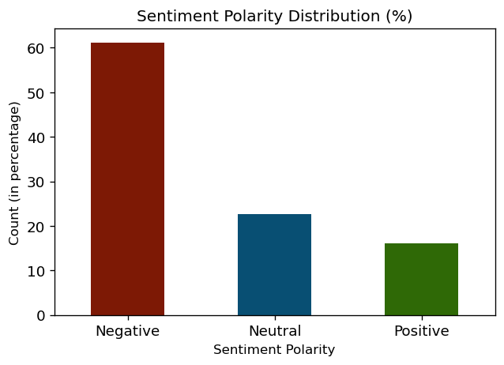

# Extracting Twitter Sentiment
---
This is a basic notebook to help kickstart in `text sentiment` analysis. The notebook aims to clean data i.e. tweets using `regex` patterns perform sentiment polarity analysis using `Neural Network model`.

# Exploring Dataset
---
The dataset information can be found at [First GOP Debate Twitter Sentiment](https://www.kaggle.com/crowdflower/first-gop-debate-twitter-sentiment) on Kaggle

### 1. Read the dataset


```python
import pandas as pd

df = pd.read_csv("Sentiment.csv")
df.head(5)
```


<div>
<table border="1" class="dataframe">
  <thead>
    <tr style="text-align: right;">
      <th></th>
      <th>id</th>
      <th>candidate</th>
      <th>candidate_confidence</th>
      <th>relevant_yn</th>
      <th>relevant_yn_confidence</th>
      <th>sentiment</th>
      <th>sentiment_confidence</th>
      <th>subject_matter</th>
      <th>subject_matter_confidence</th>
      <th>candidate_gold</th>
      <th>...</th>
      <th>relevant_yn_gold</th>
      <th>retweet_count</th>
      <th>sentiment_gold</th>
      <th>subject_matter_gold</th>
      <th>text</th>
      <th>tweet_coord</th>
      <th>tweet_created</th>
      <th>tweet_id</th>
      <th>tweet_location</th>
      <th>user_timezone</th>
    </tr>
  </thead>
  <tbody>
    <tr>
      <th>0</th>
      <td>1</td>
      <td>No candidate mentioned</td>
      <td>1.0</td>
      <td>yes</td>
      <td>1.0</td>
      <td>Neutral</td>
      <td>0.6578</td>
      <td>None of the above</td>
      <td>1.0000</td>
      <td>NaN</td>
      <td>...</td>
      <td>NaN</td>
      <td>5</td>
      <td>NaN</td>
      <td>NaN</td>
      <td>RT @NancyLeeGrahn: How did everyone feel about...</td>
      <td>NaN</td>
      <td>2015-08-07 09:54:46 -0700</td>
      <td>629697200650592256</td>
      <td>NaN</td>
      <td>Quito</td>
    </tr>
    <tr>
      <th>1</th>
      <td>2</td>
      <td>Scott Walker</td>
      <td>1.0</td>
      <td>yes</td>
      <td>1.0</td>
      <td>Positive</td>
      <td>0.6333</td>
      <td>None of the above</td>
      <td>1.0000</td>
      <td>NaN</td>
      <td>...</td>
      <td>NaN</td>
      <td>26</td>
      <td>NaN</td>
      <td>NaN</td>
      <td>RT @ScottWalker: Didn't catch the full #GOPdeb...</td>
      <td>NaN</td>
      <td>2015-08-07 09:54:46 -0700</td>
      <td>629697199560069120</td>
      <td>NaN</td>
      <td>NaN</td>
    </tr>
    <tr>
      <th>2</th>
      <td>3</td>
      <td>No candidate mentioned</td>
      <td>1.0</td>
      <td>yes</td>
      <td>1.0</td>
      <td>Neutral</td>
      <td>0.6629</td>
      <td>None of the above</td>
      <td>0.6629</td>
      <td>NaN</td>
      <td>...</td>
      <td>NaN</td>
      <td>27</td>
      <td>NaN</td>
      <td>NaN</td>
      <td>RT @TJMShow: No mention of Tamir Rice and the ...</td>
      <td>NaN</td>
      <td>2015-08-07 09:54:46 -0700</td>
      <td>629697199312482304</td>
      <td>NaN</td>
      <td>NaN</td>
    </tr>
    <tr>
      <th>3</th>
      <td>4</td>
      <td>No candidate mentioned</td>
      <td>1.0</td>
      <td>yes</td>
      <td>1.0</td>
      <td>Positive</td>
      <td>1.0000</td>
      <td>None of the above</td>
      <td>0.7039</td>
      <td>NaN</td>
      <td>...</td>
      <td>NaN</td>
      <td>138</td>
      <td>NaN</td>
      <td>NaN</td>
      <td>RT @RobGeorge: That Carly Fiorina is trending ...</td>
      <td>NaN</td>
      <td>2015-08-07 09:54:45 -0700</td>
      <td>629697197118861312</td>
      <td>Texas</td>
      <td>Central Time (US &amp; Canada)</td>
    </tr>
    <tr>
      <th>4</th>
      <td>5</td>
      <td>Donald Trump</td>
      <td>1.0</td>
      <td>yes</td>
      <td>1.0</td>
      <td>Positive</td>
      <td>0.7045</td>
      <td>None of the above</td>
      <td>1.0000</td>
      <td>NaN</td>
      <td>...</td>
      <td>NaN</td>
      <td>156</td>
      <td>NaN</td>
      <td>NaN</td>
      <td>RT @DanScavino: #GOPDebate w/ @realDonaldTrump...</td>
      <td>NaN</td>
      <td>2015-08-07 09:54:45 -0700</td>
      <td>629697196967903232</td>
      <td>NaN</td>
      <td>Arizona</td>
    </tr>
  </tbody>
</table>
<p>5 rows × 21 columns</p>
</div>


### 2. Keep only columns of interest


```python
df = df[['sentiment', 'text']]
```

### 3. Check for null values


```python
df.isnull().sum().sum()
```


    0


### 4. Distribution of the sentiment polarity


```python
sentiment_count = df['sentiment'].value_counts()

max_count = sum(list(sentiment_count.values))

sentiment_df    = pd.DataFrame({
    "sentiment_polarity" : list(sentiment_count.index), 
    "count"              : [(val/max_count)*100 for val in sentiment_count.values]
})

import matplotlib.pyplot as plt

plt.rcParams["figure.dpi"] = 120

sentiment_df.plot.bar(
    x        = "sentiment_polarity"                  , 
    y        = "count"                               , 
    rot      = 0                                     ,
    color    = ['#7d1905', '#084f73', '#2f6906']     ,
    figsize  = (6, 4)                                ,
    xlabel   = "Sentiment Polarity"                  ,
    ylabel   = "Count (in percentage)"               ,
    title    = "Sentiment Polarity Distribution (%)" ,
    fontsize = 11                                    ,
    legend   = False                                 ,
)
plt.show()
```


    

    


# Text Pre-processing
---

### 1. Performing unidecoding of the data for uniformity of texts.


```python
from unidecode import unidecode

df['text'] = df['text'].apply(lambda x: unidecode(x))
```

### 2. Removing Retweet (RT) mentions if present.


```python
import re

df['text'] = df['text'].apply(lambda x: re.sub('^RT @[a-zA-Z0-9_]+: ', "", x))
```

### 3. Remove http links present in the tweets


```python
import re

df['text'] = df['text'].apply(lambda x: re.sub('http[a-z\./:]+', "", x))
```

### 4. Remove user mentions from the tweets


```python
import re

df['text'] = df['text'].apply(lambda x: re.sub('@[a-zA-Z0-9_]+', "", x))
```

### 5. Extract all the hashtags present


```python
hashtags = list()

def get_hashtags(x):
    values = re.findall('#[a-zA-Z0-9]+', x)
    if values:
        hashtags.extend(values)
    return re.sub('#[a-zA-Z0-9]+', "", x)

df['text'] = df['text'].apply(get_hashtags)

len(set(hashtags))
```


    2150


### 6. Remove any punctuations from the tweet


```python
import re

df['text'] = df['text'].apply(lambda x: re.sub('[^a-zA-Z0-9 ]', "", x))
```

### 7. Make the texts lower case for any irregularities


```python
import re

df['text'] = df['text'].apply(lambda x: x.lower())
```

### 8. Replace two or more spaces in the text with a single space for uniform split


```python
import re

df['text'] = df['text'].apply(lambda x: re.sub('[ ]+', ' ', x))
```

# Prepare input layer for the network
---

### 1. Perform tokenization
### 2. Prepare the sequence for the input layer


```python
'''
MAX_FEATURES is the maximum number of words to keep, based on word frequency. 
Only the most common (MAX_FEATURES - 1) words will be kept. 
'''

MAX_FEATURES = 2000

from keras.preprocessing.text import Tokenizer

tokenizer = Tokenizer(
    num_words = MAX_FEATURES,
    lower     = True,
    split     = ' '
)
tokenizer.fit_on_texts(df['text'].values)

X = tokenizer.texts_to_sequences(df['text'].values)

from keras.preprocessing.sequence import pad_sequences

X = pad_sequences(X)

print(f"X - dimension : {X.shape}")
```

    X - dimension : (13871, 26)
    

# Create the Neural Network
---


```python
EMBED_DIM    = 128
LSTM_OUT     = 196
MAX_FEATURES = 2000

from keras.models import Sequential

model = Sequential()

from keras.layers import (
    Dense, 
    Embedding, 
    LSTM, 
    SpatialDropout1D
)

model.add(Embedding(
    input_dim    = MAX_FEATURES , 
    output_dim   = EMBED_DIM    , 
    input_length = X.shape[1]   ,
))

model.add(SpatialDropout1D(rate=0.4))

model.add(LSTM(
    units             = LSTM_OUT , 
    dropout           = 0.2      , 
    recurrent_dropout = 0.2      ,
))

model.add(Dense(
    units      = 3         ,
    activation = 'softmax' ,
))

model.compile(
    loss      = 'categorical_crossentropy' , 
    optimizer = 'adam'                     ,
    metrics   = ['accuracy']               ,
)

print(model.summary())
```

    Model: "sequential"
    _________________________________________________________________
    Layer (type)                 Output Shape              Param #   
    =================================================================
    embedding (Embedding)        (None, 26, 128)           256000    
    _________________________________________________________________
    spatial_dropout1d (SpatialDr (None, 26, 128)           0         
    _________________________________________________________________
    lstm (LSTM)                  (None, 196)               254800    
    _________________________________________________________________
    dense (Dense)                (None, 3)                 591       
    =================================================================
    Total params: 511,391
    Trainable params: 511,391
    Non-trainable params: 0
    _________________________________________________________________
    None
    

# Perform Model Training
---


```python
Y = pd.get_dummies(df['sentiment']).values

from sklearn.model_selection import train_test_split

X_train, X_test, Y_train, Y_test = train_test_split(X,Y, test_size = 0.33, random_state = 42)

print(f"""
    ________|___Shape___
    X_train | {X_train.shape}
    Y_train | {Y_train.shape}
     X_test | {X_test.shape}
     Y_test | {Y_test.shape}
""")
```

    
        ________|___Shape___
        X_train | (9293, 26)
        Y_train | (9293, 3)
         X_test | (4578, 26)
         Y_test | (4578, 3)
    
    


```python
model.fit(
    x          = X_train , 
    y          = Y_train , 
    epochs     = 8      , 
    batch_size = 32      , 
    verbose    = 2       ,
)
```

    Epoch 1/8
    291/291 - 22s - loss: 0.8448 - accuracy: 0.6346
    Epoch 2/8
    291/291 - 15s - loss: 0.7171 - accuracy: 0.6931
    Epoch 3/8
    291/291 - 16s - loss: 0.6493 - accuracy: 0.7257
    Epoch 4/8
    291/291 - 16s - loss: 0.6009 - accuracy: 0.7486
    Epoch 5/8
    291/291 - 16s - loss: 0.5627 - accuracy: 0.7657
    Epoch 6/8
    291/291 - 16s - loss: 0.5277 - accuracy: 0.7792
    Epoch 7/8
    291/291 - 16s - loss: 0.4994 - accuracy: 0.7959
    Epoch 8/8
    291/291 - 16s - loss: 0.4743 - accuracy: 0.8033
    


    <tensorflow.python.keras.callbacks.History at 0x1ee3f216940>


# Perform Model Evaluation
---


```python
score, accuracy = model.evaluate(
    x          = X_test , 
    y          = Y_test , 
    verbose    = 2      , 
    batch_size = 32     ,
)
print("Score    : %.2f" %score)
print("Accuracy : %.2f" %accuracy)
```

    144/144 - 2s - loss: 0.9172 - accuracy: 0.6608
    Score    : 0.92
    Accuracy : 0.66
    

# END
---
